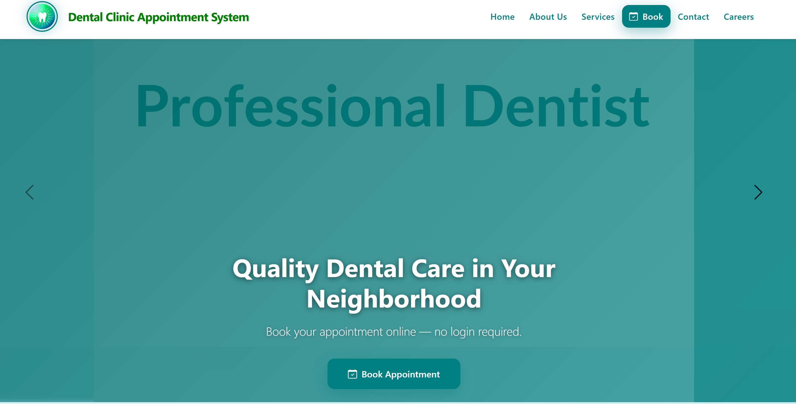

Dental Clinic Appointment System - Demo Project

A responsive web-based appointment and information portal designed as a **demo/portfolio project**. This system demonstrates full-stack web development skills using PHP, MySQL, and Bootstrap 5.

---

Table of Contents

- [✨ Features](#-features)
- [🖼️ Homepage Preview](#️-homepage-preview)
- [🛠️ Tech Stack](#️-tech-stack)
- [📁 Project Structure](#-project-structure)
- [🚀 Installation](#-installation)
- [🔒 Security Notes](#-security-notes)
- [📬 Contact](#-contact)

---

Features

Frontend Interface
- **Fully Responsive** – Optimized for mobile, tablet, and desktop views.
- **Modern Hero Carousel** – Auto-rotating slides with overlay text.
- **Intuitive Navigation** – Collapsible navbar with categorized dropdowns.
- **Service Catalog** – Clear pricing and descriptions for dental treatments.
- **Smooth Scrolling** – Anchor links scroll smoothly to sections.
- **Interactive UI** – Hover effects on buttons, cards, and links.

Backend Functionality
- **Appointment Booking** – Form handling via PHP (`php/book_appointment.php`).
- **Career Applications** – Resume upload functionality (`uploads/` folder).
- **Contact Inquiry** – Email simulation via PHP (`php/send_inquiry.php`).
- **Database Integration** – Secure connection using PDO (`php/db_connect.php`).
- **Form Validation** – Client-side (JS) and server-side (PHP) validation.

---

Homepage Preview

**Device Compatibility:**
- **Mobile:** Hamburger menu, stacked layout, touch-friendly buttons.
- **Desktop:** Full navigation bar, multi-column service grid, hover animations.

---

Tech Stack

| Layer | Technology |
|-------|-----------|
| **Frontend** | HTML5, CSS3, Bootstrap 5.3, Bootstrap Icons, Vanilla JavaScript |
| **Backend** | PHP 8.0+ (Procedural/OOP) |
| **Database** | MySQL 8.0 (via phpMyAdmin) |
| **File Handling** | PHP File Upload API (for Career Resumes) |
| **Tools** | Git, GitHub, VS Code, XAMPP/WAMP |
| **Design** | Custom Teal Theme, Glassmorphism effects |

---

Project Structure

## 📁 Project Structure

### 📄 Main Files
| File | Description |
|------|-------------|
| `index.html` | Homepage with hero carousel and service preview |
| `about.html` | About Us page (Mission, Vision, Team, Clinic Info) |
| `services.html` | Full service catalog with pricing |
| `appointment.php` | Appointment booking form |
| `careers.php` | Job application form with resume upload |
| `contact.php` | Contact/Inquiry form |
| `database.sql` | MySQL database schema and sample data |
| `.gitignore` | Git ignore configuration |
| `README.md` | Project documentation |

### 📁 Folders
| Folder | Purpose | Key Files |
|--------|---------|-----------|
| **assets/Gallery/** | Clinic photos | DC_MAIN.png, team photos |
| **assets/Icon/** | Logos & branding | DC_MLogo.png, favicon.ico |
| **assets/Slider/** | Hero carousel | slide1.jpg, slide2.jpg, slide3.jpg |
| **assets/Background/** | Section backgrounds | bg-pattern.png |
| **assets/Screenshots/** | README images | homepage.png |
| **css/** | Stylesheets | style.css (responsive design) |
| **js/** | JavaScript | script.js (validation, UI) |
| **php/** | Backend logic | db_connect.php, form handlers |
| **uploads/** | User files | Applicant resumes (PDF/DOCX) |
